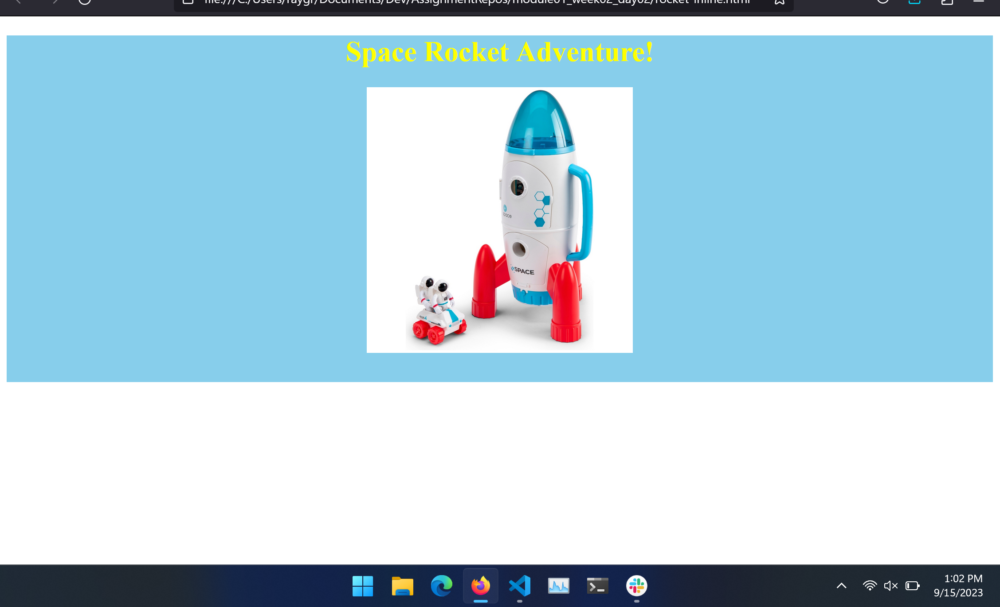
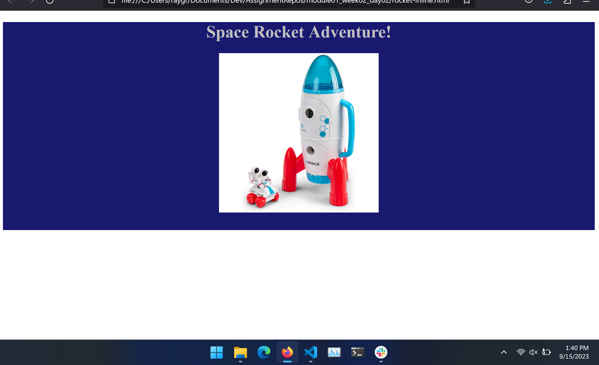

# Inline vs Style Elements vs Link Elements

## Assignment: Decorating a Space Rocket Page

In this fun and creative assignment, you will work on styling a webpage that showcases a Space Rocket toy.

  

     
    
  

### Instructions

**Part 1: Inline Styling (`rocket-inline.html`)**

1. Render a divider element `
` to hold information about the toy
   - [x] Render the header "Space Rocket Adventure!" inside the div
   - [x] Render the image of the toy (RocketToy.jpg) inside the div
  
2. Use inline styling to:
   - [x] Change the background color of the `
` to sky blue.
   - [x] Change the text color to bright yellow.
   - [x] Move the header to the horizontal center of the page
   - [x] Move the image to the horizontal center of the page 

**Part 2: Style Elements (`rocket-style.html`)**

1. Render a divider element `
` to hold information about the toy
   - [x] Render the header "Space Rocket Adventure!" inside the div
   - [x] Render the image of the toy (RocketToy.jpg) inside the div
  
2. Add a style element `<style>` at the top of the page.
    - [x] Define a style-block for a class called "rocket-div"
        - [x] Inside the style-block, set the background color to midnight blue.
        - [x] Inside the style-block, set the text color to silver.
        - [x] Move the header to the horizontal center of the page.
        - [x] Move the image to the horizontal center of the page.
    - [x] Assign the div element to the rocket-div class

Take a look at the Example folder for an idea of how the end result should look.